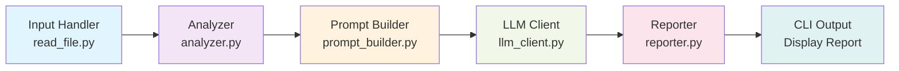

## Project Overview

The AI Code Reviewer is a modular Python application that streamlines code review processes by:
- Analyzing source code files automatically
- Extracting key metadata and context
- Sending code to an AI model for expert review
- Formatting and presenting actionable feedback

## Architecture Diagram



## Module Descriptions

### 1. **CLI Entry Point** (`cli.py`)
The orchestrator module that coordinates the entire review pipeline:
- Parses command-line arguments
- Manages workflow execution
- Displays formatted output to the user

**Key Function:** `main()`

### 2. **Input Handler** (`input_handler.py`)
Responsible for file I/O operations:
- Reads source code files safely
- Handles file encoding
- Validates file existence

**Key Function:** `read_file(filepath: str) -> str`

### 3. **Static Analyzer** (`analyzer.py`)
Performs lightweight static analysis to extract code metadata:
- Counts lines of code
- Detects programming language
- Identifies code structures (classes, functions)

**Key Function:** `analyze_code(code: str) -> dict`

**Returns:**
```python
{
    "line_count": int,
    "language": str,
    "has_classes": bool,
    "has_functions": bool
}
```

### 4. **Prompt Builder** (`prompt_builder.py`)
Constructs optimized prompts for the LLM:
- Sets system instructions with reviewer persona
- Contextualizes the code with metadata
- Formats code snippets for clarity

**Key Function:** `build_prompt(code: str, analysis: dict) -> str`

### 5. **LLM Client** (`llm_client.py`)
Interfaces with the AI model:
- Currently mocked for development
- Ready for integration with OpenAI, Claude, or other LLMs
- Sends prompts and receives reviews

**Key Function:** `get_ai_review(prompt: str) -> str`

### 6. **Reporter** (`reporter.py`)
Post-processes and formats AI responses:
- Cleans up formatting
- Prepares output for terminal display
- Placeholder for rich formatting enhancements

**Key Function:** `format_report(raw_response: str) -> str`

